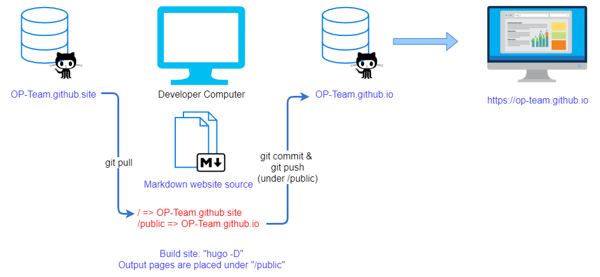

# ITRIX-Edge web site

CI Build Status: [](https://travis-ci.org/itrix-edge/itrix-edge.github.site)

An official OP Team web site using [Hugo](https://gohugo.io/) and [Academic Kickstart](https://sourcethemes.com/academic/).

## Overview


## Quickstart

1. Complete the "[Build requirement](#build-requirement)" part to ensure your environment meet the requirement.
2. Pull this repositroy:
	```=shell
	$ git pull git@github.com:itrix-edge/itrix-edge.github.site.git
	$ cd itrix-edge.github.site
	$ git submodule update --init --recursive
	```
   **Note**: if you already have local repository, follow the "[Work with team](#work-with-team)" section to update your local repository!

3. Put some awesome content! Don't forget to check [Academic document](https://sourcethemes.com/academic/docs/get-started/) to know how to customize. 
You could also use the following command on the local computer to see changes in action:
	```=shell
	$ hugo --i18n-warnings server
	```
4. Use hugo to update static contents:
	```=shell
	$ hugo -D
	```
   **Note**: Always check changes before publishing them!

5. Publish your changes to the world:
	```=shell
	$ cd public
	$ git add -A
	$ git commit
	$ git push origin master
	```
	> **Note**: Once this site enable the **Travis CI Continuous Deployment**, the web page will automatic publish by CI server after commit changes in step 6.
	> In this case, please skip above operation.
	
6. Sync changes to the github project:
	```=shell
	$ cd ..
	$ git add [contents they need to be update]
	$ git commit
	$ git pull --rebase
	$ git push origin master
	```
7. Browse [https://itrix-edge.github.io](https://itrix-edge.github.io) for our new awesome website!

## Build requirement
1. Git command line installed, [https://git-scm.com/](https://git-scm.com/)
2. Install Hugo, [https://gohugo.io/getting-started/installing](https://gohugo.io/getting-started/installing)
3. Any Markdown flavor editor, for editing site. [Sublime Text 3 + Markdown](https://www.itread01.com/content/1515506209.html), or [MarkdownPad](http://markdownpad.com/), or even [HackMD](https://hackmd.io/). Choose the one you prefer.
4. Get repositories access right. This could be done by inviting your account from project admin. Contact the project admin for this.

**Note**: Additional customize works such as sass/javascript editing needs specifically required package installed, please see [Academic customization document](https://sourcethemes.com/academic/docs/customization/) for more information.

## Customzie web site

See [academic-kickstart](https://github.com/sourcethemes/academic-kickstart) page and its document to know how to customize this site.

About how to publish the site, [Hugo quickstart](https://gohugo.io/getting-started/quick-start/) will help.

Also, the [Github page](https://pages.github.com/) has great information about content publish guide. 


## Work with team

Every time before you make the change __and__ before push changes, please sync your local repository with github:
```=shell
$ cd itrix-edge.github.site
$ git pull --rebase
$ git submodule update

```
Otherwise, you may need to manually resolve file conflict.


## License

Copyright 2020 [ITRI OP Team](https://itri.org.tw).

Site released under the [MIT](https://github.com/itrix-edge/itrix-edge.github.io/blob/master/LICENSE.md) license.

Content, posts and all technical document are copyright by authors, see document copyright notes or contact author before publishing them.


